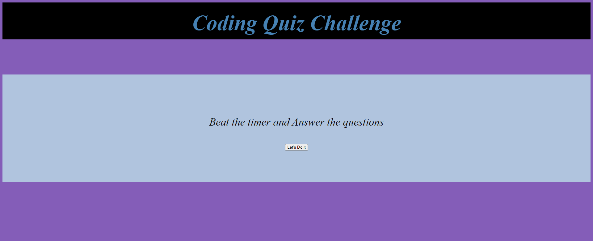

# Coding-Quiz
<!-- GETTING STARTED -->
## Homework Description
A coding quiz created with all we've learned so far with adding elements and usage of for loop and different things learned through this last week.
## Content 
-JavaScript

## Link
[Coding Quiz Challenge](https://cristofferb7.github.io/Coding-Quiz/)
## Screenshot

